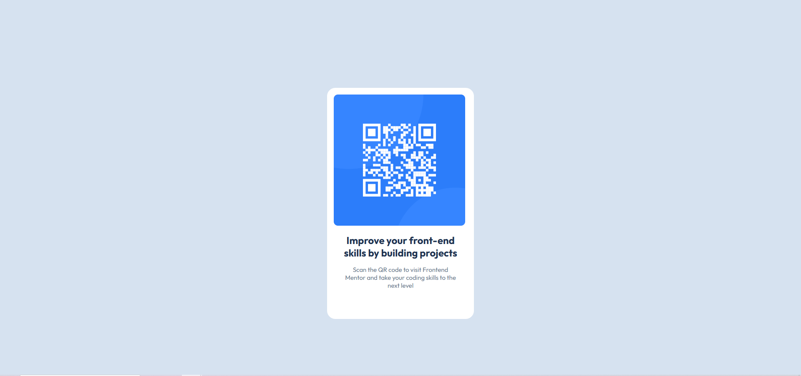

# Frontend Mentor - QR code component solution

This is a solution to the [QR code component challenge on Frontend Mentor](https://www.frontendmentor.io/challenges/qr-code-component-iux_sIO_H).

## Table of contents

- [Frontend Mentor - QR code component solution](#frontend-mentor---qr-code-component-solution)
  - [Table of contents](#table-of-contents)
  - [Overview](#overview)
    - [Screenshot](#screenshot)
  - [My process](#my-process)
    - [Built with](#built-with)
    - [What I learned](#what-i-learned)
    - [Continued development](#continued-development)
  - [Author](#author)

## Overview

### Screenshot




## My process

### Built with

- Semantic HTML5 markup
- CSS custom properties
- Flexbox
- Mobile-first workflow
- Just with my knowledge

### What I learned

The project allowed me to review HTML semantics and redo CSS in mobile first.

CSS level I used the Flexbox to place the texts

```css
div {
    display: flex;
    flex-direction: column;
    gap: 16px;
    padding: 16px;
}
```

### Continued development

I would like to improve my skills on projects with JS, I have a lot of shortcomings in JS programming

## Author

- Git - [Thibault VLT](https://github.com/ThibaultVlt)
- Linkedin - [Thibault](https://www.linkedin.com/in/thibaultvollet/)
